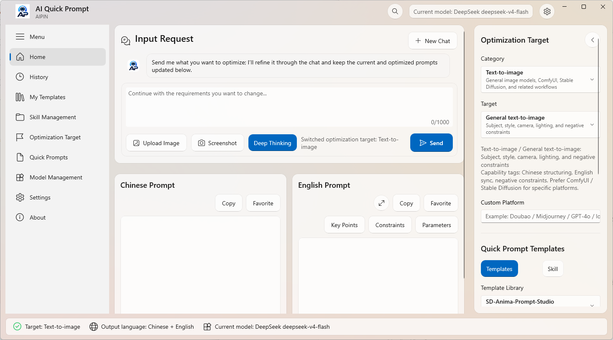
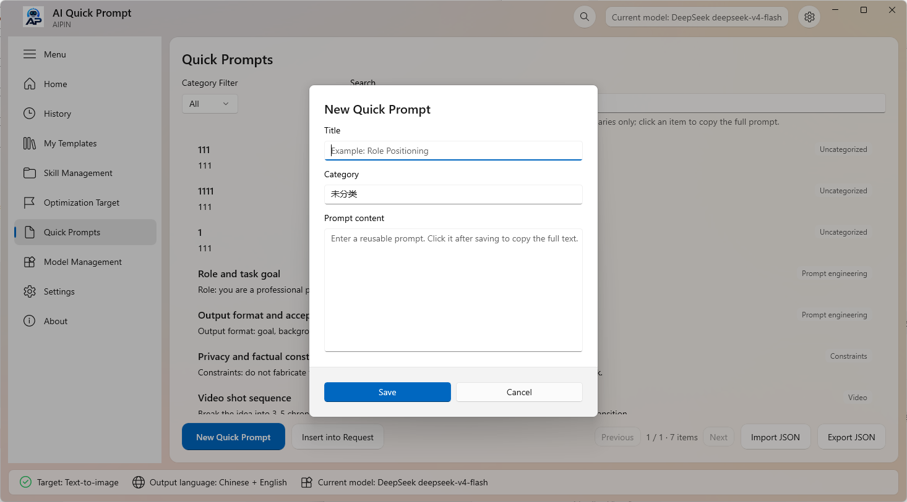
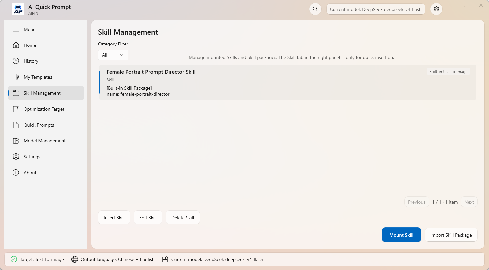
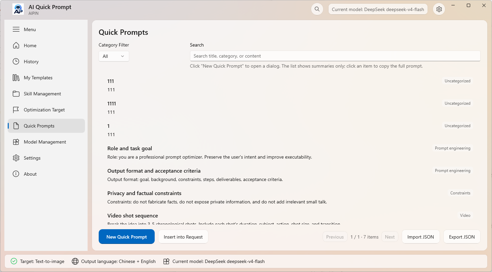
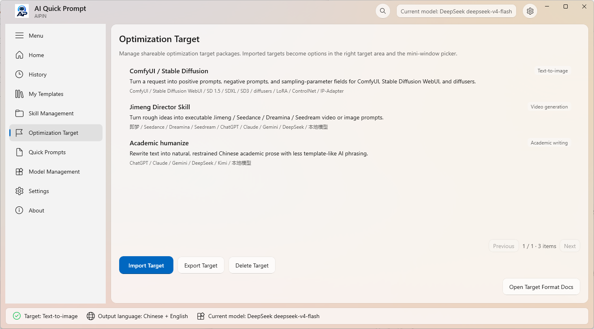

# 啊拼 / AI Quick Prompt

[English](README.md) | [简体中文](README.zh-CN.md)

啊拼 / AI Quick Prompt is a GPL-licensed Windows Fluent prompt workbench for turning rough intent, OCR text, clipboard context, image references, local templates, and mounted Skill workflows into clearer prompts.

It is built as a WinUI 3 + .NET 8 desktop app with an optional Rust OCR worker. The app is designed for Windows users who move between ChatGPT, Claude, Gemini, local OpenAI-compatible models, image models, video models, and coding agents.

## Screenshots



| Quick prompts | Skill management |
| --- | --- |
|  |  |

| Quick prompt library | Optimization targets |
| --- | --- |
|  |  |

## Highlights

- **Chat-style requirement refinement**: iterate from a rough request into a more precise prompt, with follow-up questions when the request is incomplete.
- **Chinese + English output panes**: keep the primary localized prompt and English prompt visible side by side.
- **Optimization targets**: general LLM, text-to-image, ComfyUI / Stable Diffusion field adapters, Jimeng / Seedance style video prompts, Veo 3, AI coding, Skill systems, and custom targets.
- **Skill mounting**: mount a folder containing `SKILL.md`, let AI Quick Prompt match it to the current request, then inject the Skill as high-priority workflow context for direct execution.
- **Template library**: built-in template groups inspired by `ChatGPT-Shortcut`, `prompts.chat`, and `SD-Anima-Prompt-Studio`, plus the bundled `Female Portrait Prompt Director Skill` and user templates with categories.
- **Quick prompts**: user-managed common prompts with left-click copy and right-click edit/delete.
- **JSON import/export**: templates, quick prompts, and language packs can be imported or exported without one-by-one manual entry.
- **OCR input**: Fire Eye OCR is the preferred local OCR path, with Windows Media OCR kept only as a fallback when the worker is unavailable.
- **OpenAI-compatible providers**: configure base URL, API key, and model name for local or remote chat-completions-compatible endpoints.
- **Privacy-aware defaults**: API keys are stored in Windows Credential Manager; OCR is local unless the user explicitly sends image context to a model provider.

## Current Status

AI Quick Prompt 1.0.5 is the current public GPL community release. The current codebase includes:

- WinUI 3 expanded and compact prompt windows.
- Global hotkey entry for a topmost prompt window.
- Fluent-style navigation, template panes, model management, settings, and about pages.
- Local prompt structuring fallback when model calls are unavailable.
- OpenAI-compatible model calls with model refresh and endpoint validation.
- Built-in and user-defined templates.
- AI coding and Skill-system prompt targets.
- Local OCR routing and optional Rust worker integration.
- Built-in Chinese and English UI resources plus mounted language-pack support.
- No cloud sync entry in the GitHub community edition; cloud sync architecture notes for the Microsoft Store branch are documented separately in [docs/cloud-sync-architecture.md](docs/cloud-sync-architecture.md).

The 1.0 OCR model and vendored native dependency review is complete. Fire Eye OCR may ship with embedded PP-OCRv5 model assets when the release includes the required Apache-2.0 notices. See [docs/ocr-model-license-review.md](docs/ocr-model-license-review.md), [THIRD_PARTY_NOTICES.md](THIRD_PARTY_NOTICES.md), and [docs/license-inventory.md](docs/license-inventory.md).

Copied upstream source trees, local OCR model files, and old migration reference trees are intentionally ignored by Git. The public repository keeps generated app template data, bundled Skill packages with their own notices, the integrated native OCR code, and attribution documents. See [docs/template-source-imports.md](docs/template-source-imports.md) if you need to recreate local reference folders for maintenance.

Future Windows polish, macOS adaptation, cross-platform core extraction, template/Skill data formats, and long-term platform plans are tracked in [PROMPT_INPUT_METHOD_ROADMAP.md](PROMPT_INPUT_METHOD_ROADMAP.md).

## License

The original source code and documentation in this repository are released under the GNU General Public License, version 3 or any later version (`GPL-3.0-or-later`).

- Full license text: [LICENSE](LICENSE).
- Project notice: [NOTICE.md](NOTICE.md).
- Third-party notices: [THIRD_PARTY_NOTICES.md](THIRD_PARTY_NOTICES.md).
- Working dependency inventory: [docs/license-inventory.md](docs/license-inventory.md).

Third-party components, prompt datasets, bundled Skill packages, model assets, and framework/runtime dependencies remain under their own licenses. GPL licensing of this repository does not relicense those upstream materials.

## Screens And Workflow

The intended workflow is:

1. Open AI Quick Prompt from the global hotkey or the main window.
2. Enter a rough requirement or import editable OCR text from an image/screenshot.
3. Choose an optimization target such as `通用 LLM`, `文生图`, `AI编程`, or `Skill体系`.
4. Optionally mount a `SKILL.md` folder or click a quick template to insert it into the requirement.
5. Send the request to the configured model.
6. Continue the chat if the model asks for missing details.
7. Copy, insert, save, or export the generated Chinese and English prompts.

## Skill System

AI Quick Prompt treats Skills as reusable text workflows, not executable plugins. A mounted Skill is expected to live in a folder containing `SKILL.md`.

When a user mounts a Skill:

- AI Quick Prompt reads the `SKILL.md` file.
- It stores the Skill as a user template under `Skill体系`.
- It extracts likely trigger terms from the title, description, headings, and workflow hints.
- If a later user request matches that Skill, AI Quick Prompt injects the Skill as high-priority context.
- The model is instructed to directly complete the user task according to the mounted Skill, rather than merely explaining how to write a Skill.

This is useful for workflows such as:

- image prompt systems,
- coding-agent instructions,
- writing and editing standards,
- project-specific operating procedures,
- repeatable prompt engineering playbooks.

## Built-In Template Sources

AI Quick Prompt includes built-in template groups inspired by open-source prompt projects:

- `ChatGPT-Shortcut`: general writing, translation, summarization, and prompt-engineering references.
- `prompts.chat`: open role prompt library, developer prompts, structured prompts, and image prompt references.
- `SD-Anima-Prompt-Studio`: text-to-image, character, composition, and visual prompt references.
- `Female Portrait Prompt Director Skill`: built-in text-to-image Skill workflow for female portrait prompts, fashion/ecommerce try-on prompts, style routing, reference-image preservation, prompt optimization, and safety rewriting.

The original project names are intentionally preserved in source labels for attribution. AI Quick Prompt does not include unrelated website, account, community, membership, or paid-feature logic from those projects. Bundled Skill packages retain their original LICENSE and NOTICE files under `src/PromptInputMethod.App/Data/skills/`.
The copied upstream source trees are not tracked in the public repo; only generated template data and source labels are kept.

Jimeng / Dreamina / Seedance related Skill candidates are tracked in [docs/skill-source-candidates.md](docs/skill-source-candidates.md). The built-in `即梦导演 Skill` and Jimeng template entries are original clean-room project content and do not copy candidate repository code, prompt text, or Skill files. Candidate repositories become third-party built-in templates or Skill packages only after license scope, import scope, platform terms, and privacy impact are reviewed.

## Privacy Model

AI Quick Prompt is meant to be local-first, but it can send text and optional images to a configured model provider when enabled.

- API keys are stored in Windows Credential Manager under the app credential target.
- Local OCR does not send images to model providers by itself.
- Image context is sent only when the user explicitly attaches it for a multimodal model call and image sending is enabled.
- Local redaction can reduce accidental exposure of common secrets, but it is not a formal data-loss-prevention system.
- User prompts, OCR text, and templates may contain sensitive content; do not commit local app data or screenshots with private information.

See [docs/privacy.md](docs/privacy.md) for more detail.

## Build Requirements

- Windows 10 1809 or later.
- Visual Studio 2022 or newer with:
  - .NET desktop development,
  - C++ build tools,
  - Windows SDK,
  - MSBuild,
  - CMake tools if building native OCR.
- .NET 8 SDK.
- Rust stable toolchain if building the optional Fire Eye OCR worker.

## Build

Build the WinUI app with Visual Studio MSBuild:

```powershell
& "C:\Program Files\Microsoft Visual Studio\18\Community\MSBuild\Current\Bin\amd64\MSBuild.exe" src\PromptInputMethod.App\PromptInputMethod.App.csproj /t:Build /p:Configuration=Debug /p:Platform=x64 /p:OutputPath=bin\CodexVerify\ /m /v:minimal
```

Fallback on machines where `msbuild` is on `PATH`:

```powershell
msbuild src\PromptInputMethod.App\PromptInputMethod.App.csproj /t:Build /p:Configuration=Debug /p:Platform=x64 /m /v:minimal
```

Build the optional OCR worker:

```powershell
cargo build -p fire-eye-ocr-worker --manifest-path native\Cargo.toml --release
```

`dotnet build` may fail WinUI PRI generation on some machines. Prefer Visual Studio MSBuild for the app project.

## Run

Debug x64 build:

```powershell
& "src\PromptInputMethod.App\bin\x64\Debug\net8.0-windows10.0.19041.0\win-x64\PromptInputMethod.App.exe"
```

Release x64 build:

```powershell
& "src\PromptInputMethod.App\bin\x64\Release\net8.0-windows10.0.19041.0\win-x64\PromptInputMethod.App.exe"
```

## Repository Layout

```text
src/PromptInputMethod.App/   WinUI 3 app, UI, settings, OCR, model calls, templates
src/PromptInputMethod.Core/  local prompt structuring and routing primitives
native/                      optional Rust OCR worker and patched OCR dependency tree
assets/                      app logo and OCR model assets
docs/                        privacy, license inventory, open-source references
```

Local-only folders such as `ChatGPT-Shortcut-main/`, `SD-Anima-Prompt-Studio-main/`, `reference/xiaxia-pet/`, and `assets/fire_eye/` are ignored. They are useful during maintenance, but they are not required for a normal app build.

## Open-Source Files

The repository includes:

- GPL project license.
- Project notice.
- Third-party notices and working license inventory.
- Contributing guide.
- Security policy.
- Code of conduct.
- Changelog.
- Agent instructions for future coding assistants.
- GitHub issue templates and pull request template.
- GitHub Actions Windows build workflow.
- Template source import notes for local-only upstream references.
- Product roadmap for Windows polish, macOS adaptation, and cross-platform planning.
- 1.0 release readiness notes, OCR model license review, and lightweight release checks.

For Codex for Open Source preparation, see [docs/codex-for-open-source.md](docs/codex-for-open-source.md).

Example mounted Skill: [examples/skills/aipin-template-review/SKILL.md](examples/skills/aipin-template-review/SKILL.md).

## Release Checks

Run the lightweight non-GUI release checks:

```powershell
dotnet run --project tests\PromptInputMethod.ReleaseChecks\PromptInputMethod.ReleaseChecks.csproj --configuration Release
```

Capture layout screenshots for expanded, compact, narrow, and current high-DPI display settings:

```powershell
powershell -ExecutionPolicy Bypass -File scripts\Invoke-UiScreenshotChecks.ps1
```

Create a public demo package with notices and reviewed OCR assets:

```powershell
powershell -ExecutionPolicy Bypass -File scripts\New-PublicDemoPackage.ps1
```

Create a signed MSIX sideload package:

```powershell
powershell -ExecutionPolicy Bypass -File scripts\New-MsixPackage.ps1
```

The completed 1.0 release checklist lives in [docs/release-1.0-readiness.md](docs/release-1.0-readiness.md). The forward-looking product roadmap lives in [PROMPT_INPUT_METHOD_ROADMAP.md](PROMPT_INPUT_METHOD_ROADMAP.md).

## Contributing

Small focused patches are easiest to review. Please read [CONTRIBUTING.md](CONTRIBUTING.md) and [AGENTS.md](AGENTS.md) before changing code.

If a change touches OCR capture, clipboard behavior, model requests, API-key storage, Skill mounting, or local file access, document the privacy impact in the pull request.
