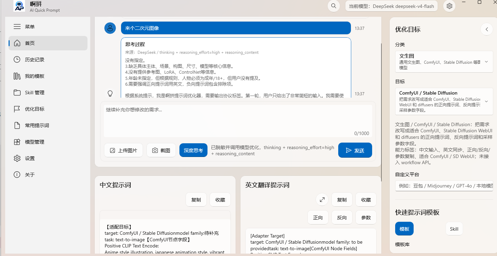
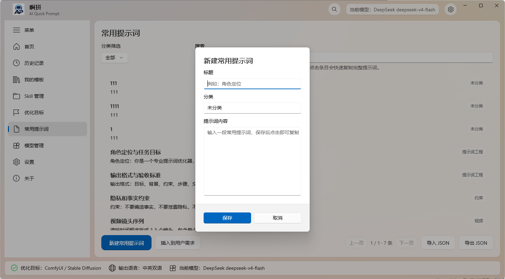
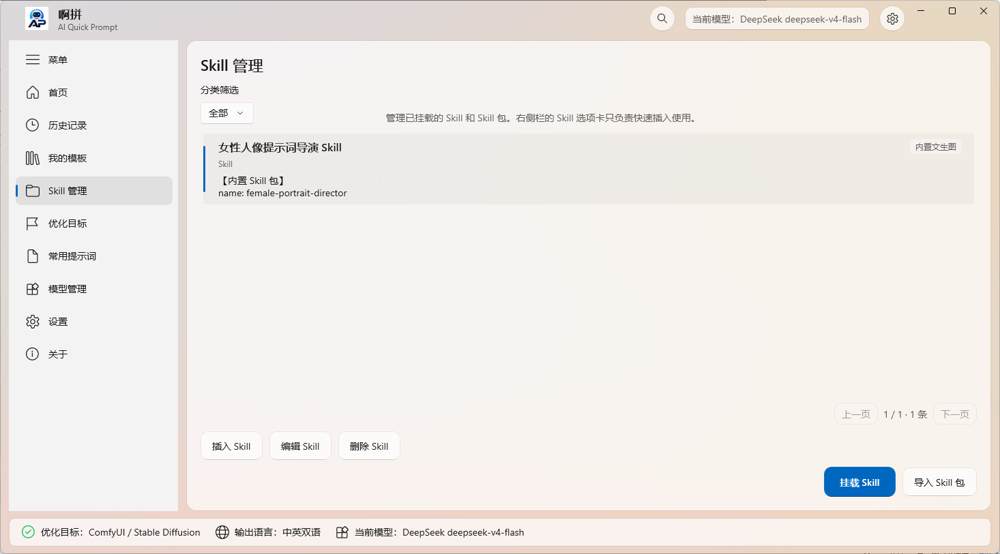
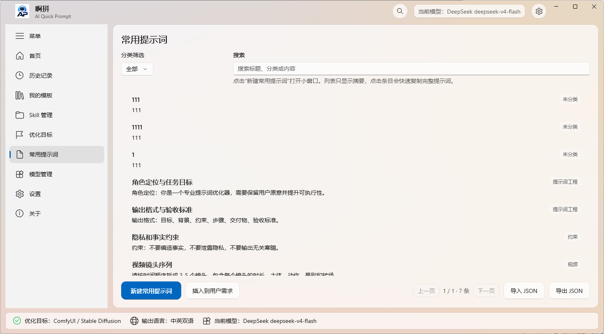
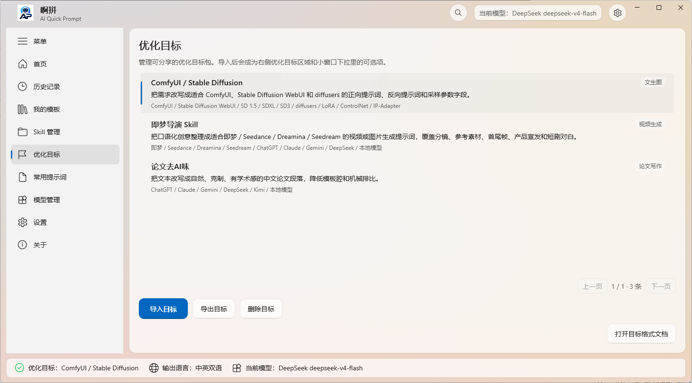

# 啊拼 / AI Quick Prompt

[English](README.md) | [简体中文](README.zh-CN.md)

啊拼是一个 Windows 桌面 AI 快速提示词工作台。它面向经常在 ChatGPT、Claude、Gemini、本地 OpenAI 兼容模型、文生图模型、视频模型和代码智能体之间切换的用户，把粗略需求、剪贴板上下文、OCR 文本、图片参考、本地模板和挂载的 `SKILL.md` 工作流整理成更清晰、可复用、可直接发送给模型的提示词。

当前公开社区版本：`1.0.5`

下载地址：[GitHub Releases](https://github.com/zhangxiaoyu66666/aping-AI-Quick-Prompt/releases)

## 1. 软件功能介绍

- 聊天式需求优化：从一句粗略想法开始，通过追问、补充和继续对话逐步生成更精确的提示词。
- 中文与英文提示词并排输出：同时保留中文提示词和英文提示词，方便在不同模型、平台和工作流之间切换。
- 优化目标：支持通用 LLM、文生图、ComfyUI / Stable Diffusion、即梦 / Seedance、Veo 3、AI 编程、Skill 体系和自定义目标。
- 字段级复制：按当前目标显示正向、反向、参数、任务、约束、验证、分镜、时长等不同按钮，减少手动拆提示词的步骤。
- Skill 挂载：挂载包含 `SKILL.md` 的文件夹，让啊拼根据当前需求匹配 Skill，并把它作为高优先级工作流上下文注入模型。
- 模板与常用提示词：内置模板库、常用提示词、收藏提示词、JSON 导入导出和用户自定义分类。
- OCR 输入：优先使用本地 Fire Eye OCR，Windows Media OCR 作为 worker 不可用时的兜底方案。
- OpenAI 兼容模型提供商：可配置 Base URL、API Key 和模型名称，连接本地或远程 Chat Completions 兼容端点。
- 隐私优先默认值：API Key 存储在 Windows Credential Manager；OCR 默认本地处理，只有用户明确发送请求并启用图片外发时才会把图片上下文发给模型提供商。
- GitHub 社区版边界：公开 GPL 分支不包含 OneDrive / WebDAV 云同步入口、设置、服务代码或 `PromptInputMethod.Core.Sync`。

## 2. 截图



| 常用提示词 | Skill 管理 |
| --- | --- |
|  |  |

| 常用提示词库 | 优化目标 |
| --- | --- |
|  |  |

## 3. 技术选型

- 桌面 UI：WinUI 3、Windows App SDK、.NET 8，保留 Windows 原生 Fluent 桌面体验。
- 核心逻辑：`PromptInputMethod.Core` 负责本地提示词路由和结构化基础能力。
- 本地存储：通过 `Microsoft.Data.Sqlite` 使用 SQLite。
- 模型调用：OpenAI-compatible Chat Completions 协议，支持 Provider 配置、模型刷新、端点验证、流式输出和深度思考展示。
- OCR：`native/` 下的可选 Rust 原生 OCR worker，Fire Eye OCR / PP-OCR 相关资产单独做许可证审查。
- 密钥存储：API Key 和 Provider 凭据进入 Windows Credential Manager，不写入仓库文件。
- 打包发布：自包含公开 zip 包、自包含 MSIX 旁加载包、Microsoft Store `.msixupload` 辅助脚本。
- 发布检查：轻量 .NET ReleaseChecks 覆盖提示词路由、模板导入导出、Skill 匹配、Provider 验证、UI 覆盖、打包策略和 GitHub 云同步排除边界。

相关文档：

- [隐私模型](docs/privacy.md)
- [许可证清单](docs/license-inventory.md)
- [开源引用](docs/open-source-references.md)
- [优化目标格式](docs/optimization-target-format.md)
- [Microsoft Store 提交说明](docs/microsoft-store-submission.md)

## 4. 未来计划

- Windows 稳定优先：托盘、全局快捷键恢复、OCR 截图可靠性、紧凑窗口一致性、高 DPI 布局、模板与 Skill 切换性能。
- 更强提示词工作流：继续增强文生图、视频、AI 编程、论文写作和用户导入优化目标的字段适配。
- 更细本地隐私控制：模型外发确认、本地敏感信息提示、日志和审计边界继续收紧。
- 模板与 Skill 生态：固化模板、常用提示词、Skill、语言包和优化目标的数据格式，方便导入导出和跨平台迁移。
- macOS 技术预研：先拆共享核心，再评估 Avalonia、.NET MAUI、SwiftUI 或其他桌面外壳方案。
- 长期跨平台方向：保持 Windows 原生体验，同时让提示词数据和 Skill 工作流具备可迁移能力。
- 商店版 / 商业分支隔离：云服务或付费功能如果继续开发，会与公开 GPL 社区分支隔离，避免混入默认开源版本。

更完整路线图见 [PROMPT_INPUT_METHOD_ROADMAP.md](PROMPT_INPUT_METHOD_ROADMAP.md)。

## 5. 个人背景信息和展望说明

我是章笑语，啊拼的开发者。我是一名二级残疾人开发者，也曾登上 CCTV 相关报道。过去大半年里，我一直在做一个 AI 叙事游戏方向的项目：让 AI 帮普通人整理设定、角色、分支、台词和演出，把脑子里那些零散但发光的故事，慢慢变成可以玩的作品。

啊拼是我在这个长期方向里先落地的一块。它现在是提示词工作台，但我真正想做的，是把“一个想法”和“一个能玩的互动故事”之间的门槛降下来。不是每个人都有团队、预算、健康的身体和完整的创作条件，但很多人心里都有一个想写出来的世界、一个想让别人看见的角色，甚至一个只属于自己的 galgame（误）。

这个项目开源免费，但要把它继续做下去，需要真实投入，也有真实的生活压力：Windows 打包、OCR 测试、模型兼容、本地化、文档、问题反馈、AI 叙事游戏实验、未来 macOS 预研，都需要时间和精力。如果啊拼对你有帮助，欢迎点 Star、转发、提 Issue、参与测试，或者通过 GitHub Sponsors 支持我继续开发。

- GitHub 个人主页 README：[zhangxiaoyu66666](https://github.com/zhangxiaoyu66666)
- 个人主页 README 仓库：[zhangxiaoyu66666/zhangxiaoyu66666](https://github.com/zhangxiaoyu66666/zhangxiaoyu66666)
- 赞助入口：[github.com/sponsors/zhangxiaoyu66666](https://github.com/sponsors/zhangxiaoyu66666)

我希望啊拼未来不只是一个单机提示词软件，而是能变成一个真正对普通用户、内容创作者、AI 编程用户、本地模型用户和叙事游戏创作者都有帮助的桌面入口。更远一点，我希望有一天人人都能写自己的 galgame：半开玩笑，半认真。你的支持会直接帮助我把它继续做下去。

## 6. 编译说明

环境要求：

- Windows 10 1809 或更高版本。
- Visual Studio 2022 或更新版本，并安装 .NET 桌面开发、C++ 构建工具、Windows SDK、MSBuild；如果构建原生 OCR，还需要 CMake 工具。
- .NET 8 SDK。
- 如需构建可选 Fire Eye OCR worker，需要 Rust stable 工具链。

使用 Visual Studio MSBuild 构建 WinUI 应用：

```powershell
& "C:\Program Files\Microsoft Visual Studio\18\Community\MSBuild\Current\Bin\amd64\MSBuild.exe" src\PromptInputMethod.App\PromptInputMethod.App.csproj /t:Build /p:Configuration=Debug /p:Platform=x64 /p:OutputPath=bin\CodexVerify\ /m /v:minimal
```

如果机器上 `msbuild` 已加入 `PATH`，也可以使用：

```powershell
msbuild src\PromptInputMethod.App\PromptInputMethod.App.csproj /t:Build /p:Configuration=Debug /p:Platform=x64 /m /v:minimal
```

构建可选 OCR worker：

```powershell
cargo build -p fire-eye-ocr-worker --manifest-path native\Cargo.toml --release
```

运行发布检查：

```powershell
dotnet run --project tests\PromptInputMethod.ReleaseChecks\PromptInputMethod.ReleaseChecks.csproj --configuration Release
```

创建自包含公开发布 zip 包：

```powershell
powershell -ExecutionPolicy Bypass -File scripts\New-PublicDemoPackage.ps1
```

创建 MSIX 旁加载包：

```powershell
powershell -ExecutionPolicy Bypass -File scripts\New-MsixPackage.ps1
```

部分机器上 `dotnet build` 可能在 WinUI PRI 生成阶段失败。建议优先使用 Visual Studio MSBuild 构建应用项目。
