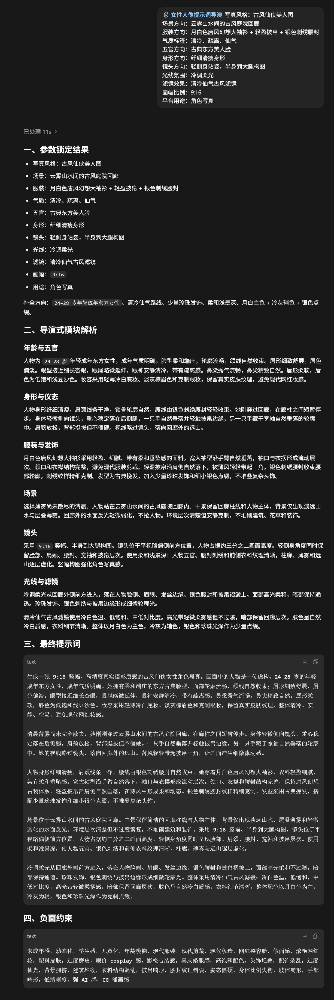

[English](README.md) | [简体中文](README_zh.md) | [日本語](README_ja.md) | [한국어](README_ko.md)

# 여성 인물 프롬프트 디렉터 Skill

여성 인물 프롬프트 디렉터 Skill은 AI 이미지 생성을 위한 구조화된 프롬프트 생성 및 시각 디렉션 시스템입니다. V1.4.1은 단일 스타일 레지스트리에서 필요한 라우트만 불러오고, 명시된 파라미터 또는 승인된 참조 이미지의 주체를 고정하여 완전한 프롬프트나 주체 보존형 이미지 편집을 생성합니다.

이 프로젝트는 단순한 프롬프트 모음이 아니라 확장 가능한 여성 인물 프롬프트 Skill 프레임워크입니다.

## 프로젝트 범위

적은 수의 입력 파라미터로 완전한 프롬프트를 생성합니다. 사용자가 명시한 요구 사항을 유지하면서 얼굴 특징, 체형, 의상, 장면, 카메라와 포즈, 조명, 필터, 플랫폼 용도, 네거티브 제약을 시각적으로 확장합니다. 대상 인물은 명확한 성인 여성이어야 하며, 사실적인 사진 질감, 절제된 표현, 화면 통일성, 안정적인 생성을 중시합니다.

## 지원 스타일

- 자연스러운 라이프스타일 사진
- 절제된 곡선미 라이프스타일 사진
- 도시 패션 화보
- 고풍 선협 인물 이미지
- 전자상거래 의류 모델 이미지
- 레트로 홍콩풍 인물 이미지
- 프렌치 릴랙스 인물 이미지
- 신중식 동양 미학 인물 이미지
- 활력 스포츠 인물 이미지
- 여행 휴가 인물 이미지
- 스튜디오 리터칭 인물 이미지
- 동양적 풍윤미 인물 이미지
- 청량한 선협 강화 인물 이미지
- 화려한 고풍 강화 인물 이미지

## 핵심 기능

- 사용자가 입력한 파라미터를 고정하고 세부화와 안정화만 수행합니다.
- 목표 스타일에 맞는 템플릿을 선택하고 서로 충돌하는 스타일 키워드의 혼합을 피합니다.
- 얼굴 특징, 체형, 의상, 장면, 카메라와 포즈, 조명, 필터를 모듈 단위로 분석합니다.
- 짧은 파라미터를 구체적인 시각 디렉션으로 확장하여 기계적인 반복을 피합니다.
- 확장된 모듈을 자연스럽고 상세하며 바로 복사 가능한 프롬프트로 통합합니다.
- 전자상거래 이미지에서는 의류 표시를 우선하고, 곡선미 스타일에서는 명확한 안전 경계를 유지합니다.
- 승인된 셀피의 얼굴 특징 또는 제품의 핵심 시각 요소를 보존하는 참조 이미지 생성을 지원합니다.

## 빠른 시작

이 저장소를 Codex Skill로 사용할 때는 `$female-portrait-director`를 호출합니다. 최소 입력 예시:

```text
스타일: 자연스러운 라이프스타일 사진
장면: 카페 창가 좌석
의상: 흰색 니트 카디건 + 밝은색 이너웨어
분위기: 깨끗하고 부드러운 느낌
화면 비율: 9:16
```

시스템은 고정된 파라미터, 바로 복사하여 사용할 수 있는 완전한 프롬프트, 네거티브 제약을 반환합니다. 전체 입력 필드는 [parameter_schema.md](skill/parameter_schema.md), 사용 예시는 [usage_examples.md](skill/usage_examples.md)를 참고하세요.

## 설치

### npx 원클릭 설치

`npx`가 포함된 [Node.js](https://nodejs.org/)가 필요합니다. Skill을 Codex에 전역으로 설치합니다.

```bash
npx skills@latest add liyue-aigc/female-portrait-director -g -a codex -y
```

설치된 Skill을 나중에 업데이트하려면:

```bash
npx skills@latest update female-portrait-director -g -y
```

### Git 수동 설치

또는 저장소를 Codex skills 디렉터리에 복제할 수 있습니다.

Windows PowerShell:

```powershell
git clone https://github.com/liyue-aigc/female-portrait-director.git "$env:USERPROFILE\.codex\skills\female-portrait-director"
```

macOS 또는 Linux:

```bash
git clone https://github.com/liyue-aigc/female-portrait-director.git "${CODEX_HOME:-$HOME/.codex}/skills/female-portrait-director"
```

Codex를 다시 시작하거나 새 대화를 시작한 뒤 다음을 호출합니다.

```text
$female-portrait-director
```

## 예시: 파라미터에서 디렉터 스타일 프롬프트까지

이 Skill은 입력을 단순히 반복하지 않습니다. 명시된 조건을 유지하고 부족한 시각적 세부 사항을 보완하여 고정된 파라미터, 모듈 분석, 완전한 프롬프트, 네거티브 제약을 출력합니다.

```text
스타일: 고풍 선협 미인 이미지
장면: 운무 산수 사이의 전통 정원 회랑
의상: 월백색 당풍 판타지 넓은 소매 의상 + 가벼운 피보 스카프 + 은색 자수 허리띠
분위기: 청량함, 거리감, 선협 분위기
얼굴: 고전적인 동양 미인 얼굴
체형: 가늘고 섬세한 체형
카메라: 살짝 옆을 향한 서 있는 자세, 상반신부터 허벅지까지
조명: 차가운 톤의 부드러운 빛
필터: 청량하고 선협 분위기의 고풍 필터
화면 비율: 9:16
용도: 캐릭터 포트레이트
```



## 출력 형식

```text
1. 고정된 파라미터
2. 모듈 분석
3. 최종 프롬프트
4. 네거티브 제약
```

## 저장소 구조

```text
.
├── README.md
├── README_zh.md
├── README_ja.md
├── README_ko.md
├── SKILL.md
├── agents/openai.yaml
├── assets/examples/
├── skill/
│   ├── skill.md
│   ├── style-registry.md
│   ├── public_instructions.md
│   ├── parameter_schema.md
│   ├── usage_examples.md
│   ├── core/
│   ├── references/
│   │   ├── director-expansion.md
│   │   └── visual-libraries.md
│   └── routes/
│       ├── commercial/
│       ├── curve/
│       ├── fantasy/
│       ├── fashion/
│       ├── lifestyle/
│       └── oriental/
├── docs/
│   ├── style_guide.md
│   ├── prompt_safety.md
│   ├── versioning.md
│   └── faq.md
└── examples/
```

## 안전 경계

텍스트 전용 생성은 가상의 명확한 성인 인물을 기본값으로 사용합니다. 참조 이미지 워크플로는 사용자 본인 또는 승인된 성인 인물의 신원과 사용 권한이 있는 제품의 시각 요소를 보존할 수 있습니다. 미성년자 성적 대상화, 노골적인 노출, 비동의 이미지, 기만적 신원 콘텐츠, 괴롭힘, 명예 훼손, 개인정보 침해 또는 기타 불법적인 목적으로 사용할 수 없습니다. 자세한 내용은 [prompt_safety.md](docs/prompt_safety.md)와 [DISCLAIMER.md](DISCLAIMER.md)를 참고하세요.

## 라이선스

이 프로젝트는 [MIT License](LICENSE)를 따릅니다. MIT License는 사용, 복사, 수정, 병합, 게시, 배포, 재라이선스 및 복제물 판매를 허용합니다. 안전 경계는 책임 있는 사용을 위한 가이드라인이며 표준 MIT License 조건을 변경하지 않습니다.

## 작성자 및 버전

- 작성자: Li Yue (李岳)
- 버전: `FEMALE-PORTRAIT-DIRECTOR-V1.4.1`
- 프로젝트: `Female Portrait Prompt Director Skill`
